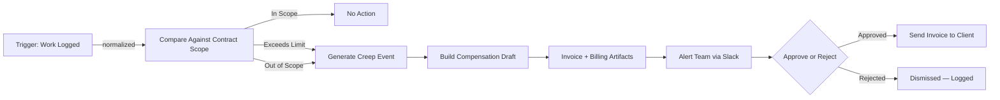
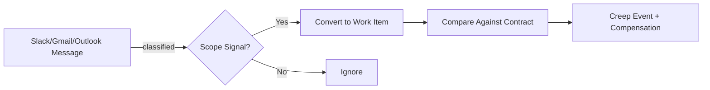

# Scope Creep Compensation Enforcer

**60% of service projects experience unbilled scope expansion. At $5K average per project, that's $360K/year walking out the door — and nobody sends an invoice.**

---

## What This Prevents

A client asks for "one quick add" on Friday afternoon. Your team builds it. Nobody logs it. Nobody invoices it. The project closes and that work disappears into margin erosion. Multiply that by every project, every month, every client — and you have a structural revenue leak that no amount of team discipline will fix.

The typical marketing agency or professional services firm with 10 active projects per month loses $5K–$10K per project in unbilled scope creep. That's $360K–$720K per year in work that was completed, delivered, and never compensated. The work happened. The invoice didn't.

This isn't a tracking problem. Your team knows the work is out of scope. The problem is that there's no structural gate between "client asked for more" and "team started building." By the time anyone thinks about billing, the leverage is gone.

**Without this:** Scope creep gets absorbed. Teams over-deliver. Revenue leaks silently. Nobody knows the number until it's too late.

**With this:** Every work item is compared against the contract. Overages are detected automatically. Compensation artifacts are generated before work is absorbed. The invoice exists whether or not anyone remembered to create it.

---

## Architecture





**How it works:**
1. **Detection** — Work items from task systems (Asana, Jira, Linear, ClickUp) or messages (Slack, Gmail, Outlook) are normalized against the contract scope. Keyword scan + Claude classify borderline requests.
2. **Enforcement** — When work exceeds agreed deliverables, revision caps, or quantity limits, the system generates scope-creep events, draft invoices, billing packages, and client-ready reports. No human memory required.
3. **Escalation** — Slack alerts with Approve/Reject buttons. Approved invoices are emailed to the client automatically. Rejected events are logged. Every decision is auditable.

---

## Setup

**Clone and install:**

```bash
git clone https://github.com/ronfarley0317/scope-creep-enforcer.git
cd scope-creep-enforcer
python3 -m venv .venv && source .venv/bin/activate
pip install -r requirements.txt
```

**Run the demo client — zero config required:**

```bash
python3 -m app.main --client demo-client
```

**Onboard a new client in 60 seconds:**

```bash
python3 -m app.main --new-client "Acme Consulting"
```

This scaffolds `clients/acme-consulting/` with template `client.yaml`, `contract_rules.yaml`, `field_mapping.yaml`, a blank SOW, a blank work log CSV, and a `.env.example`. Edit those files with the client's actual contract terms and credentials.

**Validate a client before running:**

```bash
python3 -m app.main --validate-client acme-consulting
```

Confirms all config files parse, required env vars are set for the configured work source and channels, and input files exist. Missing credentials become warnings (channel gets skipped), missing core config becomes errors (run blocked).

**See every client's status at a glance:**

```bash
python3 -m app.main --status
```

Prints a terminal table showing each client's work source, active channels, last run date, creep event count, and pending approvals.

---

## Running Modes

**One client:**
```bash
python3 -m app.main --client demo-client
```

**All configured clients (batch):**
```bash
python3 -m app.main --all-clients
```

**With live message channel polling (Slack, Gmail, Outlook, Asana comments):**
```bash
python3 -m app.main --client demo-client --poll
```

**Continuous polling every N minutes:**
```bash
python3 -m app.main --client demo-client --poll --poll-interval 30
```

**Real-time webhook server (FastAPI):**
```bash
python3 -m app.main --serve
```

**Structured JSON logging (for log aggregators):**
```bash
python3 -m app.main --client demo-client --log-json
```

**Run tests:**
```bash
python3 -m pytest tests/
```

---

## What the Demo Client Produces

The included `demo-client` simulates a marketing agency (BrightPath Creative) with a fixed-scope campaign package:

- **4 ad creatives included** → 6 delivered → 2 extra × $200 = **$400**
- **2 revision rounds included** → 4 delivered → 2 extra × $150 = **$300**
- **1 landing page section included** → 2 delivered → 1 extra × $300 = **$300**

**Total identified leakage: $1,000 per billing period**

The system generates:
- Scope-creep event JSON with full audit trail
- Draft invoice (JSON + Markdown)
- Billing review package
- Client-facing scope creep report with overdelivery percentages
- Monthly revenue leakage projection with confidence scoring
- Delivery bundle ready for finance or client send
- Run history with all artifact paths

Every output traces back to the specific contract clause, work item, and billing rule that triggered it.

---

## Supported Integrations

| Source Type | Purpose | Status |
|---|---|---|
| Local fixtures (JSON/CSV/Markdown) | SOW + work log files | ✅ Live |
| Asana | Work activity from projects | ✅ Live |
| Jira | Completed issues from projects | ✅ Live |
| Linear | Completed issues from teams | ✅ Live |
| ClickUp | Closed tasks from lists | ✅ Live |
| Slack | Real-time message monitoring | ✅ Live (polling + webhooks) |
| Gmail | Email monitoring via service account | ✅ Live (polling + webhooks) |
| Outlook/M365 | Email monitoring via Graph API | ✅ Live (polling + webhooks) |
| Asana Comments | Task comment monitoring | ✅ Live |
| Manual billing adapter | Human-review billing packages | ✅ Live |

All external API calls use exponential backoff retry (5 attempts, retries on 429/5xx, never retries on 401/403/404).

---

## Revenue Impact

- **$108K–$360K** in annual scope creep leakage prevented (conservative to median for 10-project/month agencies)
- **100%** of out-of-scope work generates a compensation artifact
- **0 days** between scope violation and invoice draft — the system acts before anyone forgets
- Payback period: 1–2 months

**The math:**

```
10 projects/month × 60% scope expansion rate × $5K avg unbilled × 12 months
= $360K annual leakage

Conservative 30% recovery in year 1 = $108K recovered
System cost: your time to configure client YAML files
```

---

## Client Configuration

Each client lives under `clients/<client-id>/` with this structure:

```
clients/acme-consulting/
├── .env                      ← credentials (gitignored)
├── .env.example              ← credential template (committed)
├── config/
│   ├── client.yaml           ← identity, source types, integrations
│   ├── contract_rules.yaml   ← deliverables, limits, billing rules
│   └── field_mapping.yaml    ← task system field aliases
├── inputs/
│   ├── sow.md                ← statement of work
│   └── work_log.csv          ← work activity fixture
├── runs/                     ← immutable per-run outputs (gitignored)
├── outputs/                  ← latest reports + invoices (gitignored)
├── billing/                  ← billing packages (gitignored)
└── state/                    ← dedup + approval state (gitignored)
```

The scaffold generator (`--new-client`) creates all of this automatically. No code changes needed to onboard a new client.

---

## Production Deployment

The `deploy/` directory contains ready-to-use systemd unit files:

- **`scope-enforcer.service`** — runs the webhook server (Slack, Gmail Pub/Sub, Outlook Graph notifications)
- **`scope-enforcer-poll.service`** — runs the polling worker every 30 minutes across all clients

Both units include security hardening (`NoNewPrivileges`, `ProtectSystem=strict`, `ProtectHome=true`), JSON structured logging to journald, and exponential restart backoff up to 5 minutes.

Deploy path: `/opt/scope-creep-enforcer/`. Service account: `scope-enforcer`. Per-client credentials are loaded from each `clients/<id>/.env` at runtime with strict isolation between clients (no env var bleed across batch runs).

---

## Enforcement Agents Collection

This is part of the **Revenue Enforcement Framework** — autonomous agents that make revenue leakage structurally impossible.

| Agent | Status | What It Enforces |
|-------|--------|-----------------|
| [Scope Creep Compensation Enforcer](https://github.com/ronfarley0317/scope-creep-enforcer) | ✅ Live | No work delivered without compensation agreement |
| [Invoice Payment Enforcer](https://github.com/ronfarley0317/invoice-enforcer) | 🔧 Building | No invoice sits unpaid beyond terms |
| [Proposal Follow-Up Enforcer](https://github.com/ronfarley0317/proposal-follow-up-enforcer) | 🔧 Building | No proposal dies in silence |
| [Enforcement Live Dashboard](https://github.com/ronfarley0317/enforcement-live-dashboard) | 🔧 Building | Watch enforcement agents operate in real time |

---

## Tech Stack

- **Python 3.10+** — Deterministic business rules engine, no opaque AI scoring for core decisions
- **Claude API** — Hybrid message classification for borderline scope signals (keyword scan first, Claude for ambiguous cases only)
- **FastAPI + uvicorn** — Webhook server for real-time event processing
- **Slack / Gmail / Outlook** — Real-time message monitoring via polling or webhooks
- **Asana / Jira / Linear / ClickUp** — Work activity ingestion
- **systemd** — Production process management with security hardening

---

## The Law

> *"Any revenue that depends on human memory, discipline, or follow-up will leak at scale."*

This agent makes unbilled scope creep structurally impossible. The contract defines the boundaries. The system enforces them. The invoice exists whether or not anyone remembered to write it.

---

## License

MIT

---

**Built by [Physis Advisory](https://github.com/ronfarley0317) — Revenue Integrity Engineering**

*We don't help you make more money. We make it impossible to lose money you already earned.*
